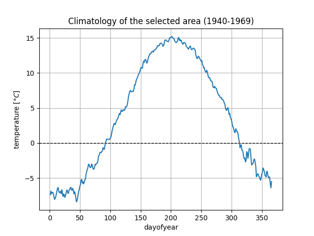
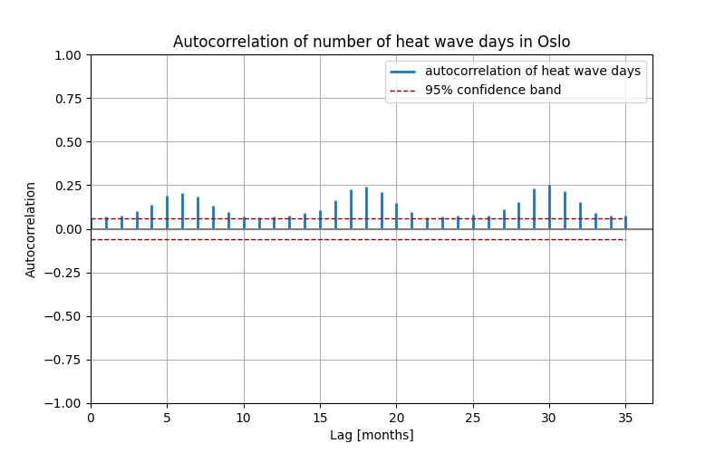
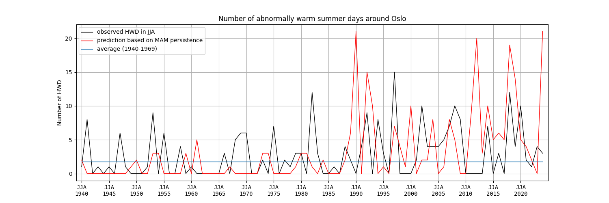
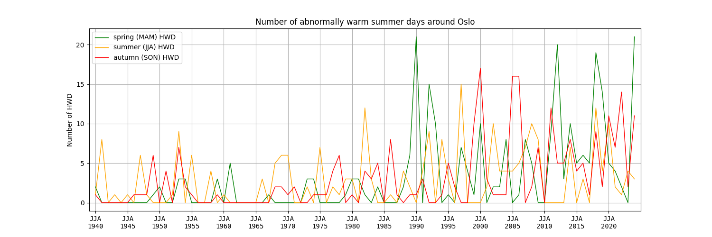
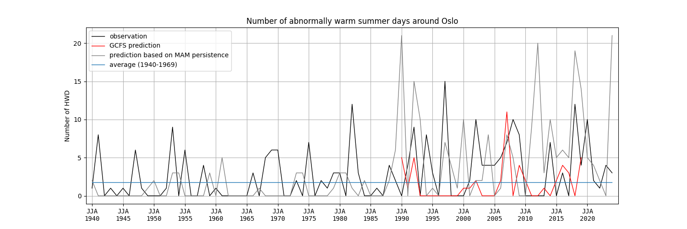

# 63-741 Predictions and Predictability of Climate

This is all the code used for the course "Predictions and Predictability of Climate".

## Chosen climate index

- Index: number of summer heat wave days (HWDs) around Oslo

- HWD definition: days with temperature more than 5°C higher than expected temperature (climatology computed for 1940-1969)

- Summer definition: June, July, August (JJA)

- Region: Southeast of Norway/around Oslo (58-63°N, 9-13°E)

- Lead time: 3 months

- Data: ERA5, daily resolution, 1940-2025

## Oslo reference climatology

## Observed HWDs around Oslo

(total number of HWDs per year)

## Autocorrelation

## Statistical prediction (hindcast)

### Hindcast skill assessment

| Prediction method | ACC   | RMSE |
| ----------------- | ----- | ---- |
| Persistence       | 0.17  | 5.65 |
| Climatology       | undef | 3.68 |

- RMSE of climatology < RMSE of persistence prediction -> climatology is on average better
- los ACC of persistence prediction -> spring persistence adds little predictive skill

=> The number of abnormally warm summer days around Oslo are not significantly correlated with the number of abnormally warm spring days

## Seasonal HWDs

## GCFS prediction

| Prediction method | ACC   | RMSE |
| ----------------- | ----- | ---- |
| Persistence       | 0.17  | 5.65 |
| Climatology       | undef | 3.68 |
| GCFS              | 0.09  | 5.22 |

- RMSE of climatology < RMSE of GCFS prediction < RMSE of persistence -> climatology is on average the best, persistence and GCFS prediction are similarly bad
- low ACC of persistence prediction -> spring persistence adds little predictive skill
- even lower ACC of GCFS prediction -> the model prediction does not capture the variability of the index

As calculated before, the low ACC of the persistence prediction suggests that the number of abnormally warm summer days around Oslo are not significantly correlated with the number of abnormally warm days during the previous spring.

Even though the GCFS prediction's RMSE is slightly lower than that of the persistence prediction (suggesting it is a slightly better predictor), the ACC of the GCFS model prediction is even lower than the already low ACC of the persistence prediction.

This suggest that the model does not capture the variability of this index at all, and the prediction based on climatology is on average still the best predictor for the number of summer HWDs around Oslo.

